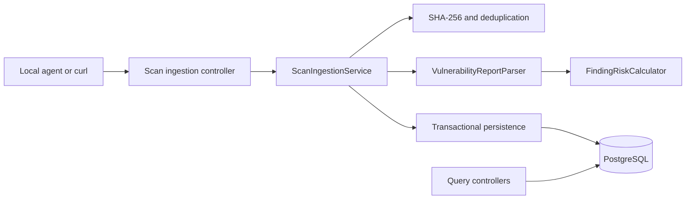

# Architecture

## Context

Vulnerability scanners produce rich reports, but teams still need a repeatable
way to accept reports, remove duplicate work, normalize findings, prioritize
risk, and query the result. VulnFlow establishes that behavior locally before
introducing cloud messaging and storage.

## Current system

The backend is a single deployable Spring Boot application organized by feature:

```text
com.vulnflow
├── asset
├── scan
├── finding
├── ingestion
├── dashboard
├── shared
└── config
```

Each feature owns its web, application, and persistence code. Dependencies flow
from controllers to services to repositories. The ingestion feature collaborates
with asset, scan, and finding capabilities through explicit interfaces.



## Ingestion sequence

1. Resolve the asset or return `404`.
2. Reject empty, oversized, or non-JSON uploads.
3. Read the bounded file into memory and compute SHA-256.
4. Return the existing scan when `(asset_id, content_hash)` already exists.
5. Persist a scan as `PROCESSING`.
6. Parse Trivy `Results[*].Vulnerabilities[*]`.
7. Calculate deterministic risk and create `OPEN` findings.
8. Persist findings and mark the scan `COMPLETED` in one transaction.
9. On parser or persistence failure, record the scan as `FAILED` and return a
   stable error response.

The database unique constraint handles concurrent duplicate uploads in addition
to the early lookup.

## Data model

- `Asset` identifies the host, image, or application being assessed.
- `Scan` records one accepted scanner report and its processing lifecycle.
- `Finding` records a vulnerability snapshot tied to both scan and asset.

UUID identifiers are generated by the application. Timestamps use UTC instants.
Flyway owns the PostgreSQL schema; JPA validates but never creates or updates it.

## Future event-driven boundary

The synchronous HTTP adapter is temporary. A future message consumer can call
the same parser, scorer, and persistence/application behavior after S3 and SQS
delivery. The event contract must carry an immutable object reference, asset
identity, scanner type, content hash, schema version, correlation ID, and event
timestamp.

The target cloud data store is DynamoDB, so its keys and indexes will be chosen
from measured API access patterns rather than copied mechanically from the local
relational schema.

## Quality attributes

- **Idempotency:** hash plus asset identity and a database constraint.
- **Auditability:** accepted malformed reports leave a `FAILED` scan row.
- **Maintainability:** feature packages and replaceable parser/scoring
  interfaces.
- **Security:** bounded input, stable errors, no report logging, correlation IDs,
  and no committed credentials.
- **Operability:** health probes, structured logs, configurable timeouts, and
  versioned migrations.
- **Cost control:** local-first work and temporary AWS environments only.

